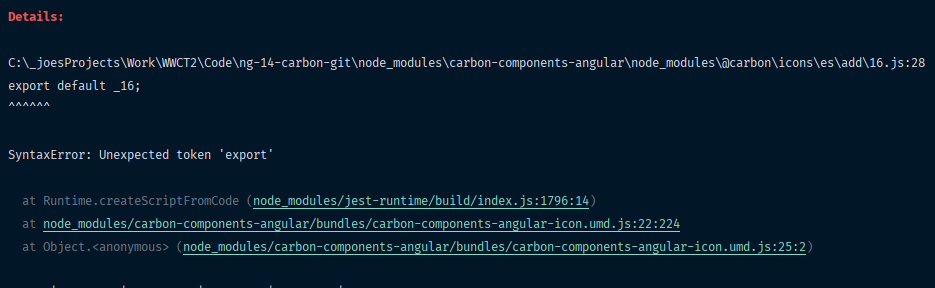

# carbon-jest-transformer-issue

I'm trying to implement IBM Carbon library, angular version.
I want to use jest testing platform to run unit tests.
Problem is that Jest don't like the way how Icon module is written.

By browsing the web and some forums found out that a transformer in jest configuration should be set.
I'm using `jest-preset-angular` package also for transforming. But problem is that the error is still popping-up.

I do not know how to progress so need help here.

Thank you very much for any help or poking to right way.

Running `npm run test` to get the error below.

